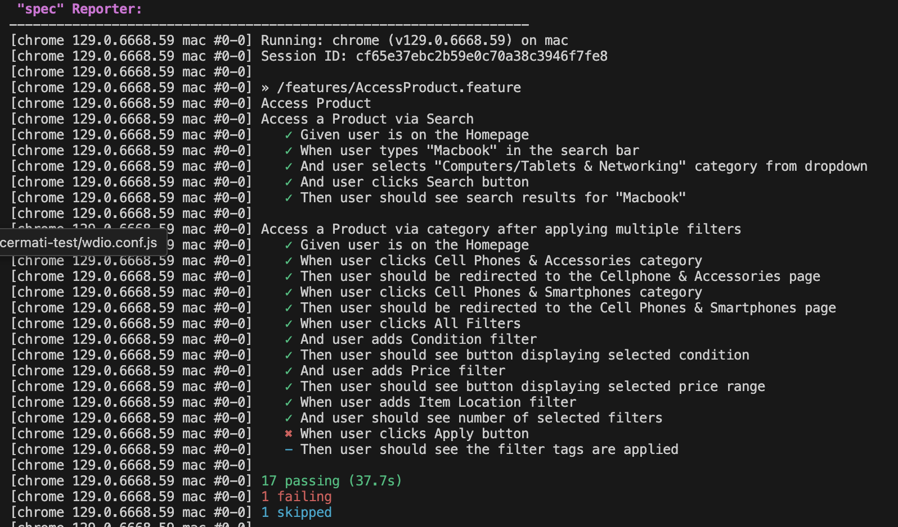

## Description
This project implements automation testing for eBay using WebdriverIO and Cucumber. The focus is on verifying product access through various scenarios, including searching for products via categories and applying filters.

## Approach
The automation scripts are designed to:
- Simulate user interactions on the eBay website.
- Validate that the filters and search functionalities work as expected.
- Ensure that the results returned match the applied criteria.

## Prerequisites
Install following requirements:
- [Node.js](https://nodejs.org/)
- [Webdriverio](https://webdriver.io/docs/gettingstarted/)

## How to Run the Tests

- **Navigate to the Project Directory**\
  cd < project-directory >
- **Install Dependencies**\
  npm install
- **Run the tests In the terminal**\
  npm run wdio
- **Open allure report**\
  npm run allure-report

## Sample Test Result
